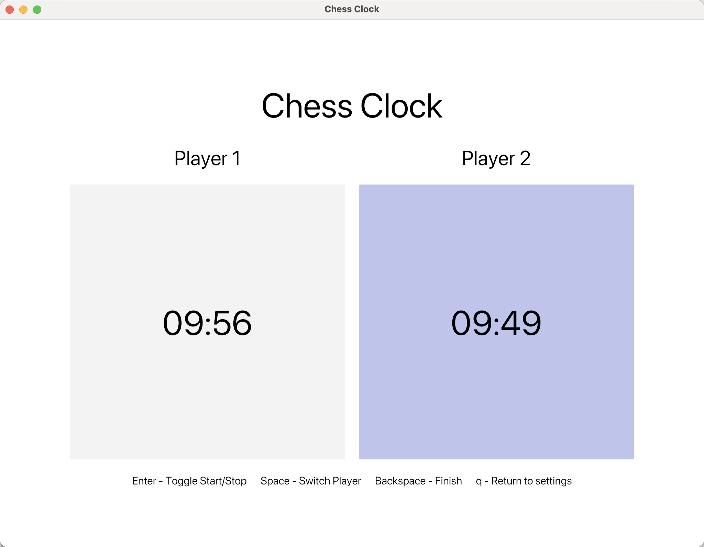

# Rusty Chess Clock

This is a simple chess clock implementation in Rust. It can be used either as a command-line tool (UNIX only) or with a GUI.

## Features

### GUI

The chess clock GUI features a simple settings menu which allows the user to set several options alongside the chess clock itself.




### Command Line

The features of the CLI version are similar to those of the GUI version.


## Installation

To install the library, which has no dependencies other than the Rust compiler,
run the following command in your terminal.

```bash
cargo install --git https://github.com/michaelbennett99/rusty_chess_clock.git
```

### GUI

The GUI module requires the `gui` feature to be enabled. To build the GUI module, run:

```bash
cargo build --bin chess_clock --features gui --release
```

This will create an executable in the `target/release` directory.

### Command Line (UNIX only)

The command line module requires the `cli` feature to be enabled. To build the command line module, run:

```bash
cargo build --bin chess_clock_cli --features cli --release
```

This will create an executable in the `target/release` directory.
